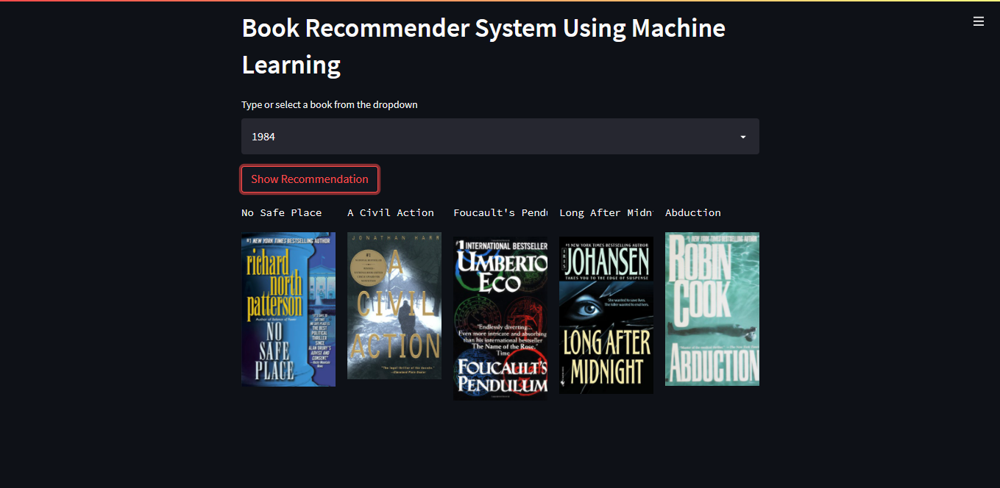
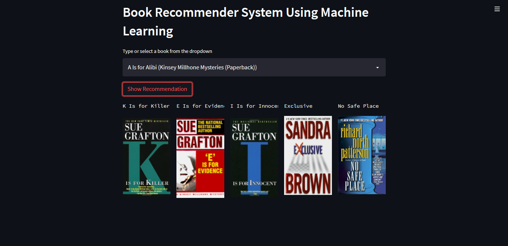
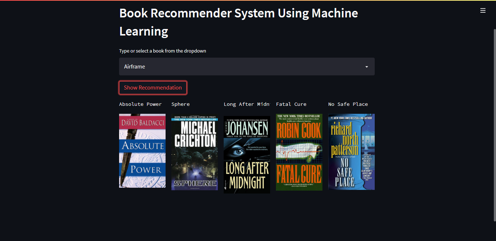

# Project: Book Recommendation System Using Machine Learning! | Collaborative Filtering Based

Recommendation systems are becoming increasingly important in today’s extremely busy world. People are always short on time with the myriad tasks they need to accomplish in the limited 24 hours. Therefore, the recommendation systems are important as they help them make the right choices, without having to expend their cognitive resources.

The purpose of a recommendation system basically is to search for content that would be interesting to an individual. Moreover, it involves a number of factors to create personalised lists of useful and interesting content specific to each user/individual. Recommendation systems are Artificial Intelligence based algorithms that skim through all possible options and create a customized list of items that are interesting and relevant to an individual. These results are based on their profile, search/browsing history, what other people with similar traits/demographics are watching, and how likely are you to watch those movies. This is achieved through predictive modeling and heuristics with the data available.

# Types of Recommendation System :

### 1 ) Content Based :

- Content-based systems, which use characteristic information and takes item attriubutes into consideration .

- Twitter , Youtube .

- Which music you are listening , what singer are you watching . Form embeddings for the features .
	
- User specific actions or similar items reccomendation .
	
- It will create a vector of it .
	
- These systems make recommendations using a user's item and profile features. They hypothesize that if a user was interested in an item in the past, they will once again be interested in it in the future
	
- One issue that arises is making obvious recommendations because of excessive specialization (user A is only interested in categories B, C, and D, and the system is not able to recommend items outside those categories, even though they could be interesting to them).

### 2 ) Collaborative Based :
		
- Collaborative filtering systems, which are based on user-item interactions.
	
- Clusters of users with same ratings , similar users .
	
- Book recommendation , so use cluster mechanism .
	
- We take only one parameter , ratings or comments .
	
- In short, collaborative filtering systems are based on the assumption that if a user likes item A and another user likes the same item A as well as another item, item B, the first user could also be interested in the second item . 
	
- Issues are :

	- User-Item nXn matrix , so computationally expensive .

	- Only famous items will get reccomended .

	- New items might not get reccomended at all .   

### 3 ) Hybrid Based :
	
- Hybrid systems, which combine both types of information with the aim of avoiding problems that are generated when working with just one kind.

- Combination of both and used now a days .

- Uses : word2vec , embedding .           

# About this project:

# Book Recommendation System Documentation

Welcome to the documentation of the Book Recommendation System project. This system is designed to provide personalized book recommendations to users based on their reading habits and preferences. Here, we'll provide an overview of the project, steps taken, and instructions on how to use it.

# Demo:

# Dataset has been used:

* [Dataset link](https://www.kaggle.com/ra4u12/bookrecommendation)

## Table of Contents

- [Introduction](#introduction)
- [Problem Statement](#problem-statement)
- [Dataset Description](#dataset-description)
- [Project Architecture](#project-architecture)
- [Usage](#usage)

## Introduction

The Book Recommendation System is a machine learning project that aims to enhance the reading experience for users by suggesting books that align with their interests. By analyzing user ratings and book attributes, the system provides tailored recommendations, encouraging users to discover new titles and authors.

## Problem Statement

The primary goal of the Book Recommendation System project is to develop an effective recommendation engine that offers users personalized book suggestions. This system employs collaborative filtering techniques to leverage user ratings and generate accurate recommendations. The challenge lies in processing and combining multiple datasets, filtering out less relevant data, training the recommendation model, and creating a user-friendly interface for recommendations.

## Dataset Description

The project involves three main datasets: 'books', 'users', and 'ratings'. Each dataset provides unique insights into books, readers, and their interactions. The datasets contain attributes such as 'ISBN', 'Book-Title', 'Book-Author', 'Year-Of-Publication', 'Publisher', 'Image-URL-S', 'Image-URL-M', and 'Image-URL-L'. To prepare the data for the recommendation system, the following steps were taken:

1. Renaming Column Names: Columns with unconventional names were renamed for clarity and consistency.
2. User Filtering: Users who have rated more than 200 books were identified for enhanced personalization.
3. Data Merging: The 'books', 'users', and 'ratings' datasets were merged to create a comprehensive dataset.
4. Data Filtering: Books with at least 50 user ratings were selected for quality recommendations.

## Project Architecture

The Book Recommendation System project consists of the following key steps:

1. Data Preprocessing:
   - Renaming columns for better understanding
   - Filtering users with substantial ratings
   - Merging datasets for comprehensive insights
   - Filtering books based on ratings

2. Model Training:
   - Creating a pivot table to structure user ratings
   - Training a recommendation model using Collaborative Filtering and CSR matrix

3. Nearest Neighbors Clustering:
   - Importing the Nearest Neighbors clustering algorithm
   - Testing the model to find similar books

4. Web Application:
   - Developing a user-friendly web application using Flask
   - Input: Book title or ISBN
   - Output: Personalized book recommendations.

## Usage

1. Prepare or obtain the 'books', 'users', and 'ratings' datasets.
2. Execute Data Preprocessing to clean, filter, and merge the datasets.
3. Train the recommendation model using collaborative filtering techniques and CSR matrix.
4. Implement Nearest Neighbors clustering for finding similar books.
5. Create the Flask web application for personalized book recommendations.